# Auto Scaling Groups

- [Auto Scaling Groups](#auto-scaling-groups)
  - [Types of Scaling](#types-of-scaling)
  - [Why Use Auto Scaling?](#why-use-auto-scaling)
  - [AWS Auto Scaling Group Architecture](#aws-auto-scaling-group-architecture)
    - [Components](#components)
    - [How AWS Auto Scaling Group Works](#how-aws-auto-scaling-group-works)
    - [How does the AWS Auto Scaling Group Architecture Provide High Availability and Scalability?](#how-does-the-aws-auto-scaling-group-architecture-provide-high-availability-and-scalability)
  - [Creating a Launch Template](#creating-a-launch-template)
    - [Creating an Instance from Launch Template](#creating-an-instance-from-launch-template)
  - [Creating an Auto Scaling Group](#creating-an-auto-scaling-group)
  - [Accessing Load Balancer and Target Group](#accessing-load-balancer-and-target-group)
  - [Terminating Instances](#terminating-instances)
  - [Terminating All Instances and Auto Scaling Group](#terminating-all-instances-and-auto-scaling-group)
  - [Notes](#notes)

## Types of Scaling
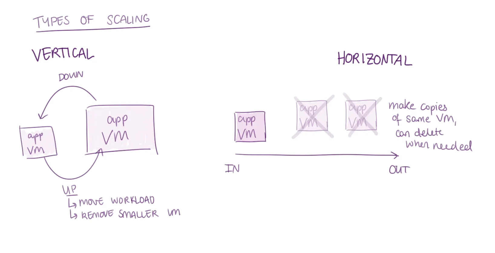

There are 2 types of scaling:

Vertical | Horizontal
---|---
Scale up/down - Changes size of a single VM | Scale in/out - Add/remove VMs as needed
Scale up: Moves workload to bigger VM, removes smaller VM | Scale out: As load on one app VM increases, make another one (duplicates of the same machine)
Scale down: If VM doesn't require so much CPU/memory etc, can move to smaller VM | Scale in: Can delete VMs as needed

## Why Use Auto Scaling?
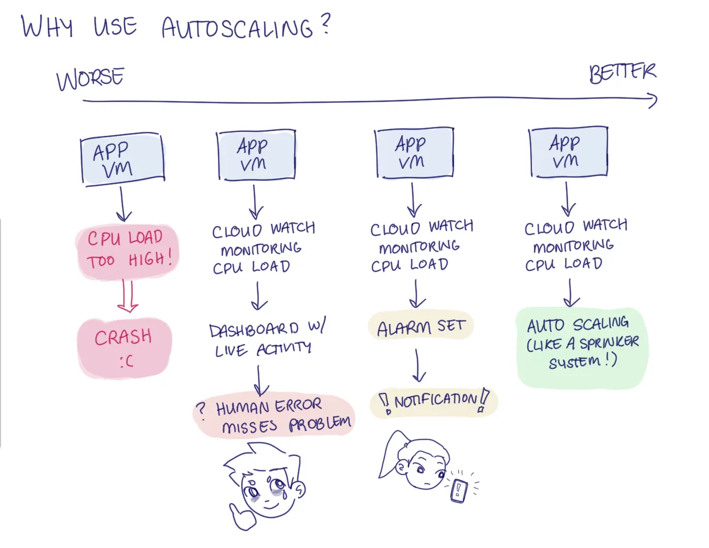
1. If no one checking VM constantly, could get a lot of traffic, CPU load might get too high, VM crashes/falls over.
2. By default, on cloud providers, there is monitoring that happens whenever you make a VM.
   * CloudWatch monitoring happening, monitors CPU load etc, dashboard (doesn’t fix problems, but you can see if any problems arise)
   * Not humanly possible to not miss anything. When missed, cannot respond to problem
3. Better solution than just having dashboards: have alarm/alerts set up
   * Trigger could be based on CPU load, if reach certain % for a certain amount of time triggers alarm
   * Usually average over a certain amount of time
   *  If alarm is triggered, can choose to receive notifications (e.g. emails)
   *  If notification sent to you, could be away on holiday etc, can then respond to the issue.
4. Much better solution than all the above is auto scaling.
   * Compare to sprinkler system, every house has a fire alarm, if problem is detected, alarm goes off, sprinkler system automatically responds for you to handle the load. 

## AWS Auto Scaling Group Architecture
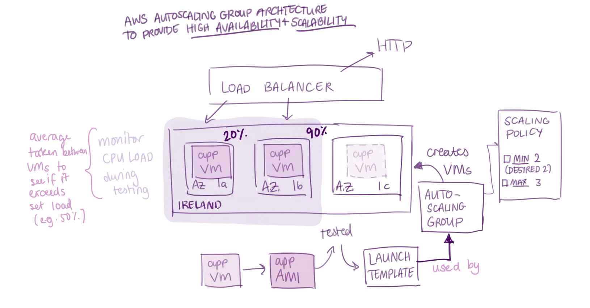

### Components
1. Launch Template
   - Defines how to build each instance, basically the blueprint for new EC2s
     - AMI (VM image)
     - Instance type (t3.micro)
     - Key pair
     - Security groups
     - User data (startup script)
2. Auto Scaling Group
   - Uses the launch template to create/destroy instances (horizontal scaling) to match the rules defined:
     - Minimum number of instances (also the desired capacity - what it tries to maintain)
     - Maximum number of instances
3. Target Group
   - A list of targets (instances) that a load balancer can send traffic to
   - Routes traffic only to the healthy instances
   - Defines health check rules (e.g. CPU usage(?))
4. Load Balancer
   - Distributes traffic across all instances in the ASG
   - Continuously runs health checks on targets in the target group

### How AWS Auto Scaling Group Works

* App VM is created
* App AMI created from working VM and tested
* Launch template is created from app AMI
* Create Auto Scaling Group - Scaling policy: Minimum 2 VMs at all times, Maximum 3 
* Target group and load balancer are also created when creating auto scaling groups
* Auto Scaling Group uses launch template to create VMs
* VMs are spread between different availability zones
* Load balancer regularly does instance health checks on instances within the target group, if doesn't get a 200 ok for an instance, it is unhealthy and the load balancer stops routing traffic to that instance
* Auto scaling group removes any unhealthy instances from the target group and terminates it
* Using the launch template, auto scaling group creates a duplicate instance which automatically gets registered with the target group
* Once health checks pass, the load balancer sends traffic to that instance

### How does the AWS Auto Scaling Group Architecture Provide High Availability and Scalability?

* High Availability:
  * Launches instances across multiple Availability Zones
  * If one AZ goes down, instances in other AZs still serve traffic
* High Scalability:
  * Can set parameter for if CPU reaches a certain demand for a certain amount of time, autoscales as needed

## Creating a Launch Template

1. Test that the AMI plus User Data works and launches the app successfully
2. Go to Launch Templates and click 'Create Launch Template'
3. Provide a name for the Launch Template such as `tech511-nikki-for-asg-sparta-lt`
4. Under Application and OS Images (Amazon Machine Image), select 'My AMIs' and then 'Owned by me', and find your AMI
5. Select Instance type (t3.micro) and enter Key Pair
6. Under Network Settings, either select and existing security group or create a new one (allow http 3000)
7. Then add User Data (don't need to include export command if not using database)
8. Click 'Create Launch Template'
   
### Creating an Instance from Launch Template
1. Click on instance ID and click 'Actions' and then 'Launch Instance from Template'
2. Make sure Launch Template is correct
3. Don't need to add/change anything
4. Click 'Launch Instance'
5. Test the instance works

## Creating an Auto Scaling Group
1. Go to Auto Scaling Group and select 'Create Auto Scaling Group'
2. Provide name for Auto Scaling Group
3. Select your Launch Template
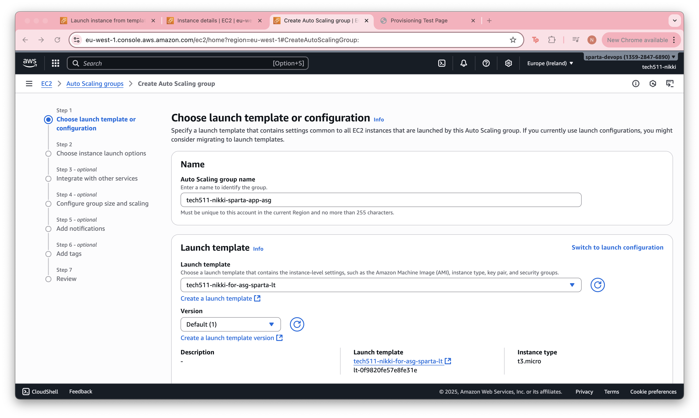
4. Under Network, select Availability Zones. Search Devops and select 1a, 1b, and 1c (eu-west)
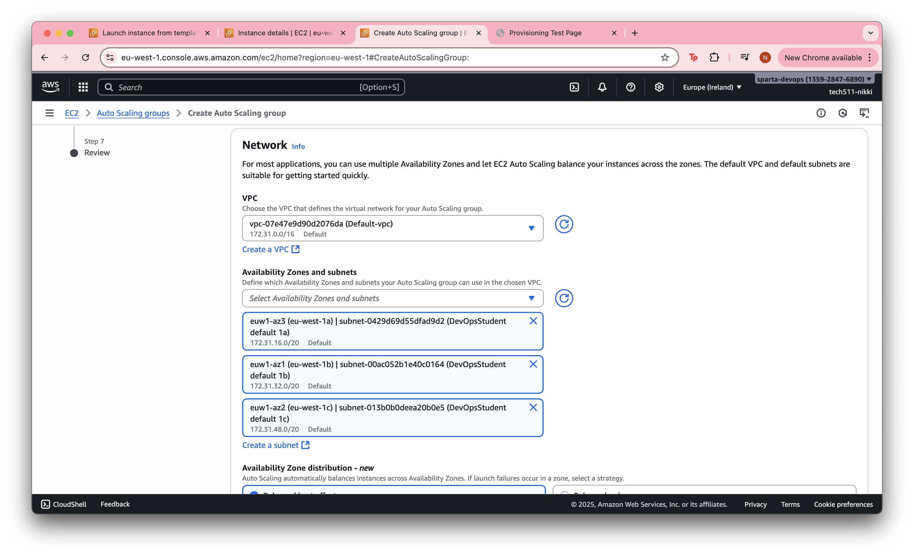
5. Under Availability Zone Distribution, select 'Balanced best effort'
6. In 'Integrate with other services - optional', under Load Balancing, select 'Attach to a new load balancer'
7. Under Attach to a new load balancer, select load balancer type 'Application Load Balancer' and provide a name for the load balancer. Under Load Balancer Scheme, select 'Internet-facing'. Under Listeners and Routing, click 'Create a new target group'
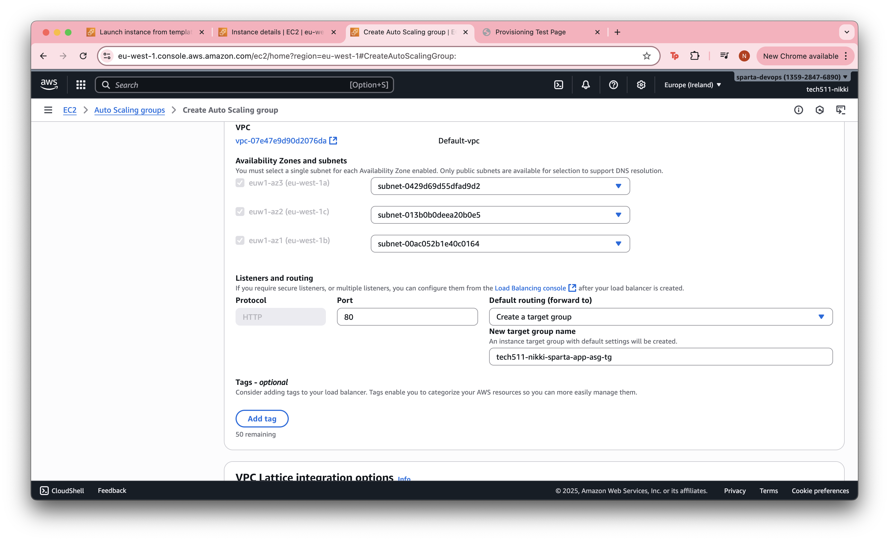
8. Under Health Checks, select 'Turn on Elastic Load Balancing health checks' and set the Health Check Grace Period (120 seconds)
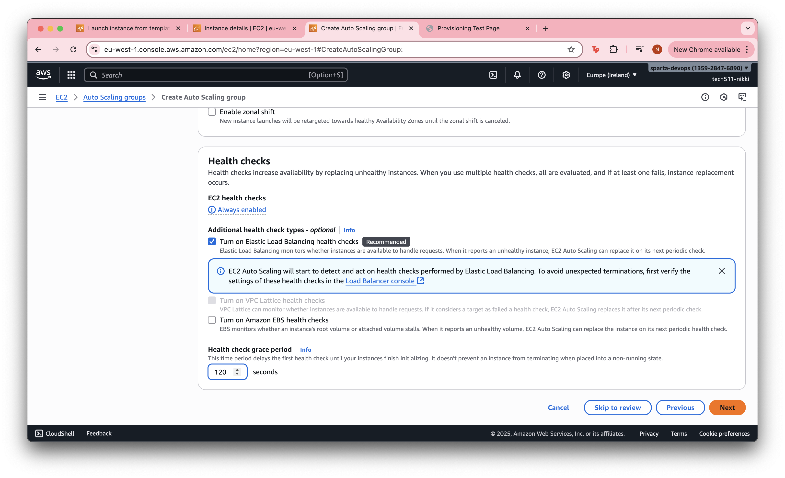
9. In Configure Group Size and Scaling - optional, set the Desired Capacity to 2

10. Under Scaling, set the Min Desired Capacity to 2 and the Max Desired Capcity to 3. Then select 'Target Tracking Scaling Policy', metric type select 'Average CPU Utilization' and provide a Target Value and Instance Warmup
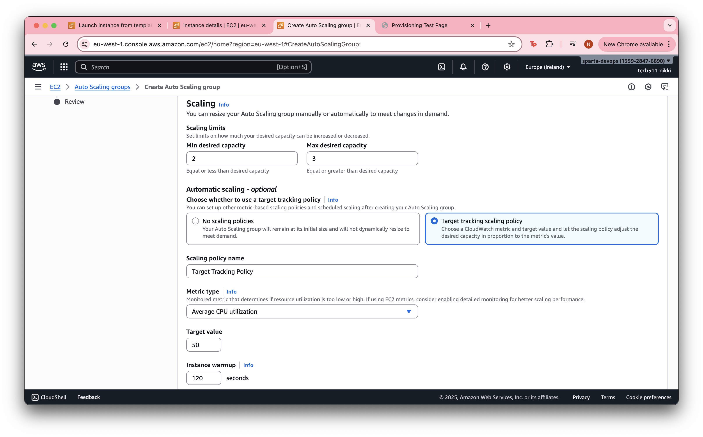
11. Under Instance Maintenance Policy, select 'No Policy' and under Additional Capacity Settings, select 'Default'
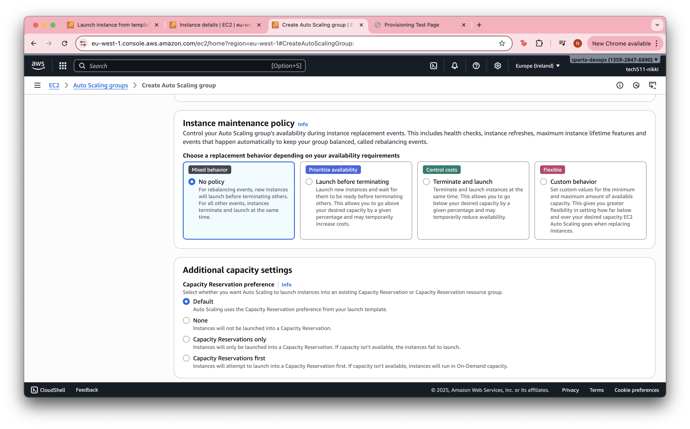
12. Add Name tag for instances created by the Auto Scaling Group
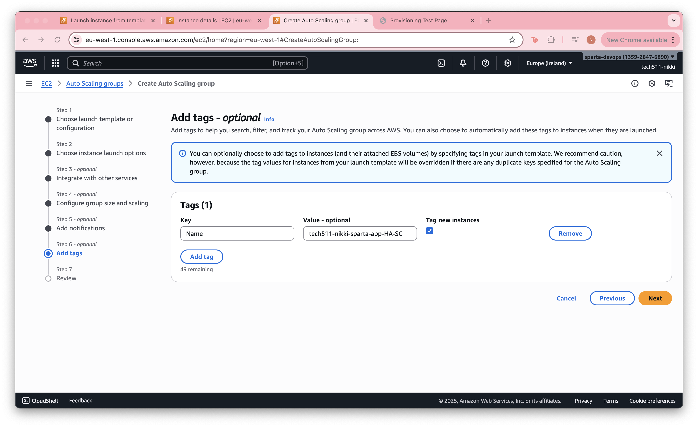
13. Review details and then click 'Create Auto Scaling Group'
14. Can view information about the instances from the auto scaling group page under Instance Management
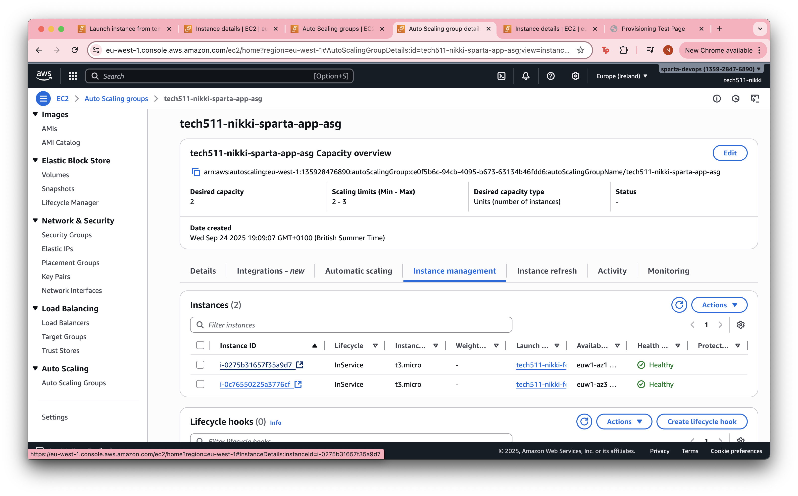
15. Check both instances work

## Accessing Load Balancer and Target Group
1. Under Integrations and Load Balancing, click on the Load Balancer Target Groups link

2. Can see the instances registered in the target group and also number of healthy/unhealthy instances
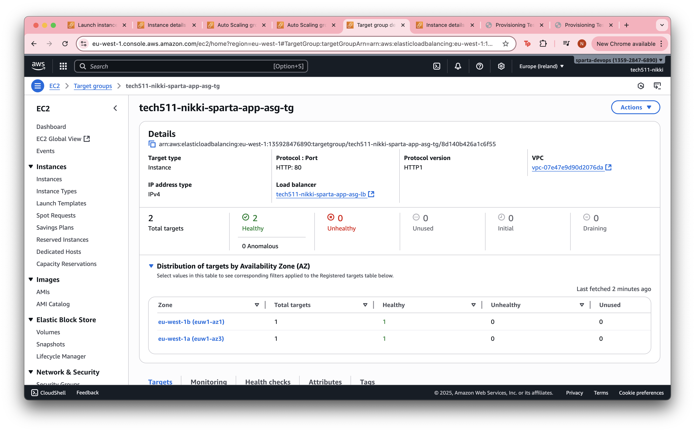
3. Can click on Load Balancer link to see details. Can use DNS name to check if App works
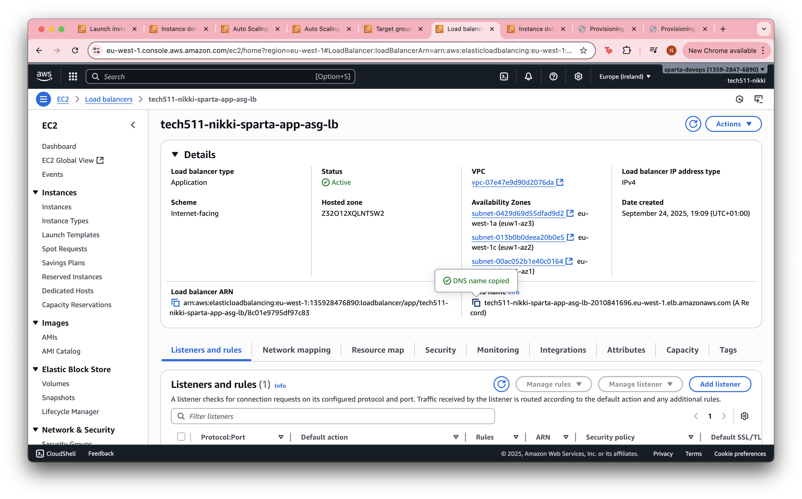
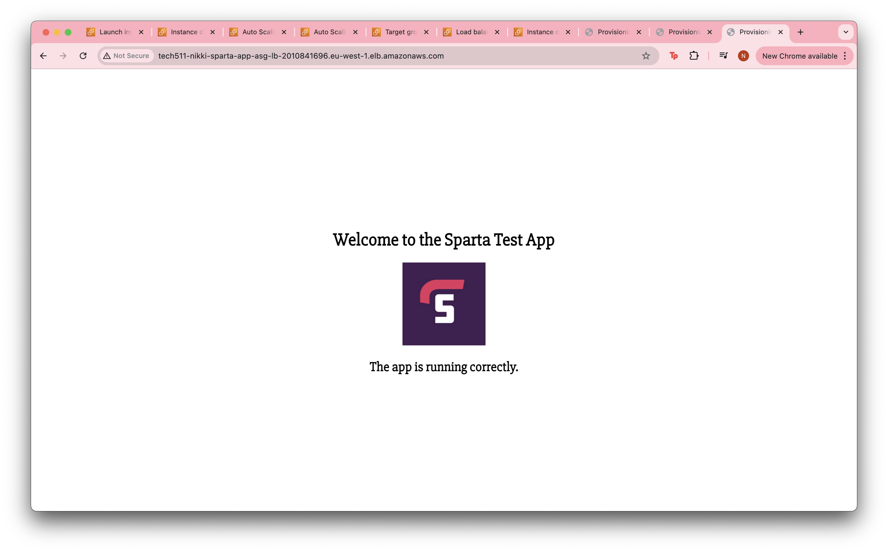

## Terminating Instances
* If try to terminate one instance, the Auto Scaling Group detects we are below min desired capacity and creates a duplicate immediately
* While this happens, current running instances are temporarily affected for a short period
* When instance is replaced, all works as normal again

## Terminating All Instances and Auto Scaling Group
Delete in this order:
1. Load Balancer
2. Target Group
3. Auto Scaling Group

## Notes
* Don't need to include Name Tag in Launch Template because Auto Scaling Group fills in the blank

