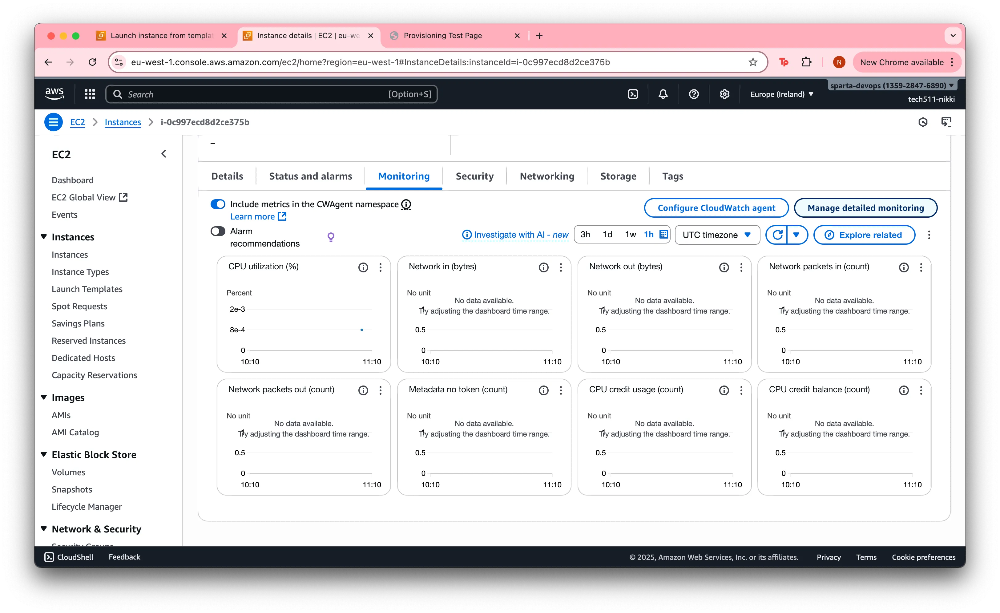
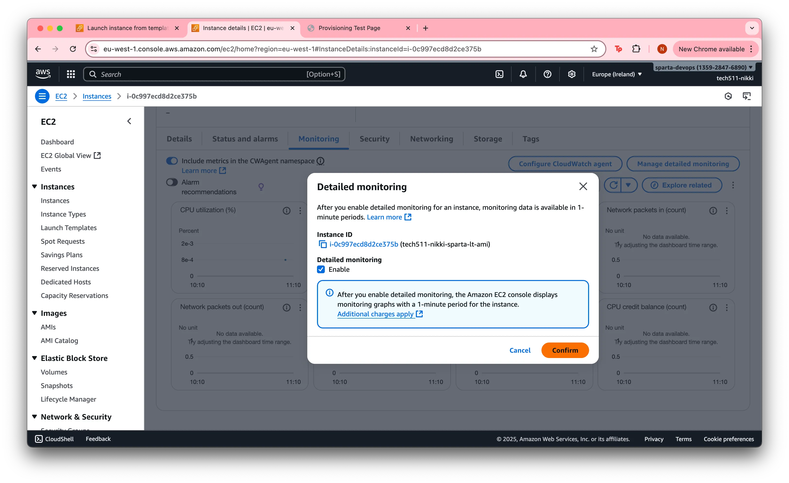
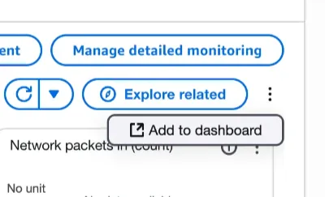
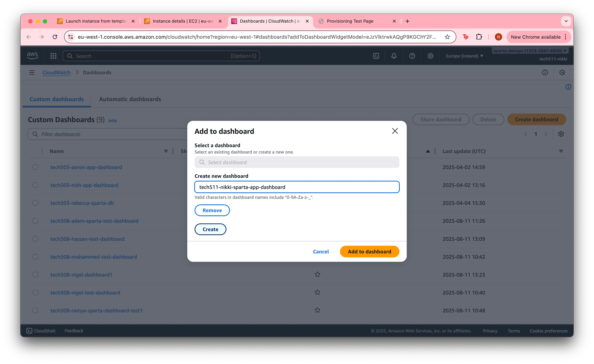
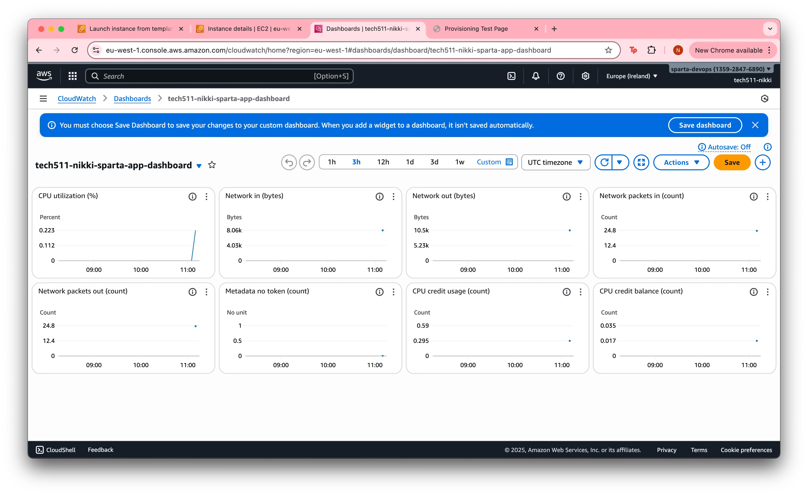
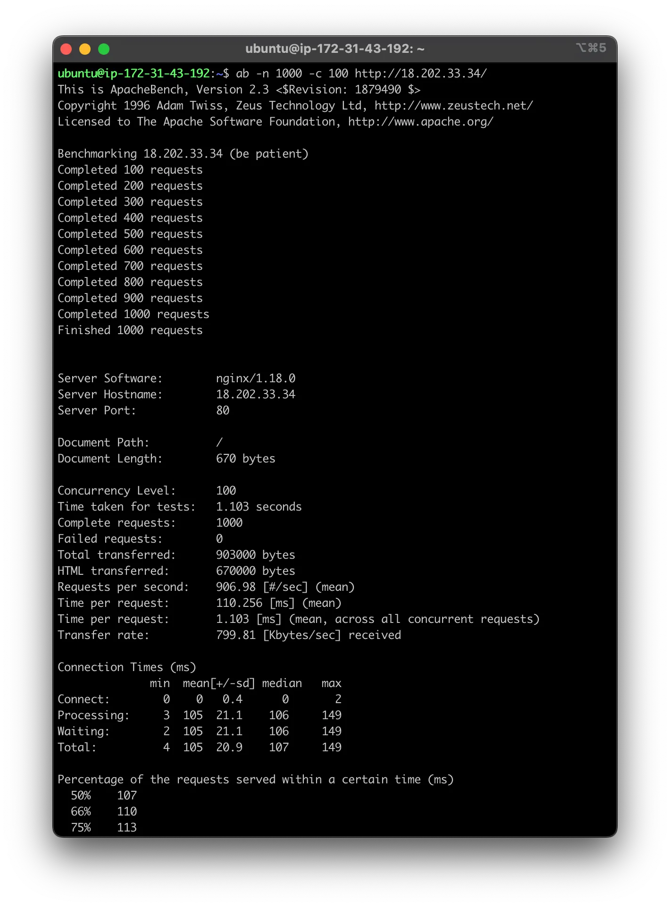
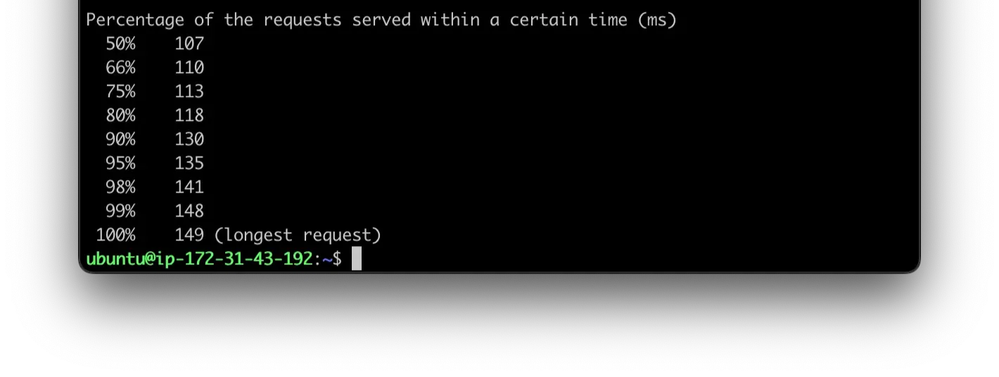
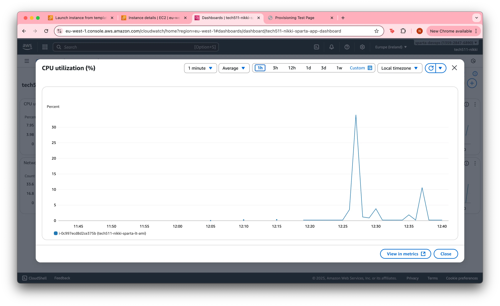

# Dashboard

- [Dashboard](#dashboard)
  - [What is a Dashboard used for?](#what-is-a-dashboard-used-for)
  - [How to Create a Dashboard](#how-to-create-a-dashboard)
  - [Testing with Apache Bench](#testing-with-apache-bench)
    - [First CPU Utilisation Graph](#first-cpu-utilisation-graph)

## What is a Dashboard used for?
* Monitors and visualises metrics, helps you to see the health and performance of you app at a glance.
* Shows CPU usage

## How to Create a Dashboard

1. Create instance from launch template - add name tag
   
2. On instance page, click ```Monitoring```
   

3. Click ```Manage detailed monitoring```, enable and confirm - Gives update every minute (otherwise every ~5 mins)


4. Click the 3 dots below 'Manage detailed monitoring' button, then click `Add to dashboard`
<br>


5. Create new dashboard - new dashboard name - and click `Create` before clicking `Add to dashboard`
<br>


6. Should take you to new dashboard



## Testing with Apache Bench

sudo apt update -y && sudo apt upgrade -y

sudo apt-get install apache2-utils

1000 requests in groups of 100 
ab -n 1000 -c 100 http://18.202.33.34/

10000 requests in groups of 200 
ab -n 10000 -c 200 http://18.202.33.34/




### First CPU Utilisation Graph


**Spike 1:** sudo update and upgrade ~34%
<br>
**Spike 2:** Install Apache Bench ~4%
<br>
**Spike 3:** First ab command ~2%
<br>
**Spike 4:** Second ab command ~10%