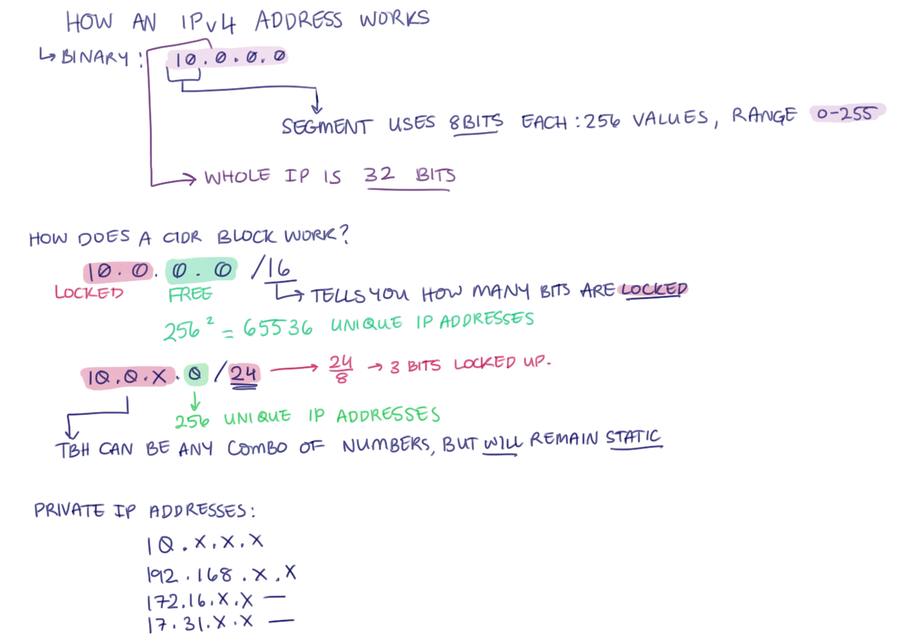
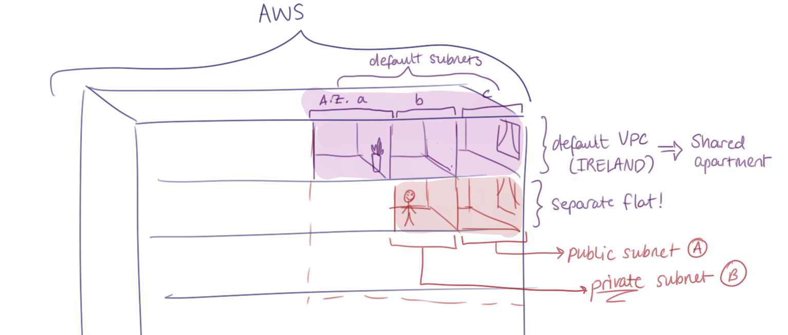

# Securing the Database in our 2-Tier App Deployment

- [Securing the Database in our 2-Tier App Deployment](#securing-the-database-in-our-2-tier-app-deployment)
  - [Intro to Virtual Networking](#intro-to-virtual-networking)
    - [What is a Virtual Network](#what-is-a-virtual-network)
    - [Terminology used with Virtual Networks](#terminology-used-with-virtual-networks)
    - [Understanding Ipv4 Addresses and CIDR Blocks](#understanding-ipv4-addresses-and-cidr-blocks)
    - [Understand Defaults for the AWS](#understand-defaults-for-the-aws)
    - [Plan Custom VPC for 2-Tier Development of Sparta Test App](#plan-custom-vpc-for-2-tier-development-of-sparta-test-app)
  - [Creating Custom VPC](#creating-custom-vpc)
    - [Step-by-Step Setup](#step-by-step-setup)
  - [Using App VM as a Jumpbox to Login to DB VM](#using-app-vm-as-a-jumpbox-to-login-to-db-vm)

## Intro to Virtual Networking

### What is a Virtual Network

* A way for devices/computers running in the cloud to talk to each other
* Think of it a bit like an apartment
* We set up the range of private IP addresses to be used on the network
* You split up the space (range of IP addresses) into one or more subnets (like rooms within the apartment)
* To protect it:
  * You can manually set up the flow of traffic around the network
  * Firewall rules to protect network, subnets, and individual devices

### Terminology used with Virtual Networks

* VPC/VNet - The overall virtual network
  * AWS: VPC (Virtual Private Cloud)
  * Azure: VNet (Virtual Network)
  * GCP: VPC (Virtual Private Cloud)
* Subnet
  * Section of the network
* Firewall/security group/NSG/NCL (on AWS)
  * Rules to allow/deny traffic
* Route table
  * Tell traffic where to go
* Peering
  * Connecting different networks together

### Understanding Ipv4 Addresses and CIDR Blocks

### Understand Defaults for the AWS

* AWS provides a default VPC (virtual network) in every region under your account
* Default VPC has a default architecture and uses default rules which are permissive (for other people in the same VPC to access)

* If you imagine AWS as an apartment building
  * A shared apartment in the building is default VPC (Ireland region)
  * Within that is 3 rooms (default subnets in 3 different availability zones)
  * In a shared apartment, you have flatmates who can see your stuff and move it around if needed
  * That's why it is better to make your own private VPC, so you can control your security and no one else can touch your stuff/settings
  * When you have your own separate VPC (apartment), you will have 2 subnets (2 rooms). 
    * Each subnet can be likened to a room where different purposes occur:
      * Public subnet has a rule that allows you to look outside while the private subnet has a different setup.
      * Private subnet contains all the sensitive data; database goes here
    * Public subnet - Availability Zone A
    * Private subnet - Availability Zone B

### Plan Custom VPC for 2-Tier Development of Sparta Test App

* The VPC has the CIDR block of 10.0.0.0/16 - Private IP address range -> anything on our network will start with 10.0...
* Virtual network split into Public Subnet and Private Subnet
* App VM goes in Public Subset, when given a IP address for this, will start with 10.0.2... as Public Subset given CIDR block of 10.0.2.0/24
* Database VM goes in Private Subset
* Traffic comes through internet on HTTP through Internet Gateway - Don't want it to have any direct route into our database VM - Want to direct flow of traffic
* Route tables: Only need to set up one for app, use default route table for database (allows internal traffic)

## Creating Custom VPC
### Step-by-Step Setup
 
**Step 1 – Create the VPC**
- Choose VPC Only.  
- Name tag: `tech511-nikki-2tier-first-vpc`.  
- IPv4 CIDR: `10.0.0.0/16`
 
**Step 2 – Create Subnets**
Select VPC name

- Public Subnet  
  - Name: `tech511-nikki-public-subnet`.  
  - Availability Zone: `eu-west-1a` (Ireland 1a).  
  - IPv4 CIDR block: `10.0.2.0/24`.  
 
- Private Subnet  
  - Name: `tech511-nikki-private-subnet`.  
  - Availability Zone: `eu-west-1b`.  
  - IPv4 subnet CIDR block: `10.0.3.0/24`.  
 
**Step 3 – Create Internet Gateway**
- Name tag: `tech511-nikki-2tier-first-vpc-ig`.  
- Attach to the VPC (shows as “detached” until attached).  
- Actions → *Attach to VPC* → Select the VPC.  
 
**Step 4 – Configure Route Tables**
- Default route table → already exists for private/internal traffic.  
- Create a public route table:  
  - Name: `tech511-nikki-2tier-first-vpc-public-rt`.  
  - Select the VPC.  
  - Click Create.  
 
- Associate the public subnet with this route table:  
  - Subnet Associations → Edit → Select Public Subnet.  
 
- Under routes select edit routes
  - Destination: `0.0.0.0/0` (means all internet traffic).  
  - Target: the Internet Gateway created earlier.  
 
**Step 5 – Check VPC and Resource Map**
- Go to Your VPCs and select the created VPC.  
- Scroll down to view the resource map for an overview of attached components.  
 
 
**Step 6 – Create Database Instance**
- Use an AMI with MongoDB preinstalled.  
- Launch a DB instance as usual but under Network settings:  
  - Set VPC to the custom VPC.  
  - Set Subnet to the private subnet.  
  - Disable Auto-assign public IP.  
- Security group note:  
  - Previous security groups from the default VPC cannot be reused.  
  - Create a new security group for this VPC.  
  - Rule:  
    - Type: Custom TCP  
    - Port range: `27017`  
    - Source type: Anywhere (temporary — later restrict to subnet IPs).  
 
**Step 7 – Create Application Instance**
- Launch from AMI (not from template, as templates are tied to specific VPCs).  
- Under Network settings:  
  - Select the custom VPC.  
  - Select the public subnet.  
  - Enable Auto-assign public IP.  
- Create a new security group:  
  - Allow HTTP and SSH (source type: Anywhere for testing).  
- Update user data:  
  - Change `DB_HOST` to the private IP address of the DB instance.  

## Using App VM as a Jumpbox to Login to DB VM
1. SSH into App VM
2. Create a .pem file in .ssh folder with same name as in local machine
   
  `touch tech511-nikki-aws.pem`
3. Copy and paste .pem file from local machine to App VM using Nano command 
   
  `nano tech511-nikki-aws.pem`
4. Change file permissions to User Read Only
   
  `chmod 400 tech511-nikki-aws.pem`
5. Double check that the permissions have been changed
   
  `ls -l`
6. SSH into DB VM using the SSH command copied from AWS instance page, remember to change the root to ubuntu
   
  `ssh -i "~/.ssh/tech511-nikki-aws.pem" ubuntu@10.0.3.55`