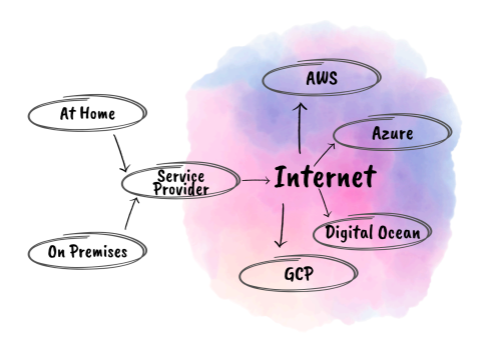

# Intro to Cloud

- [Intro to Cloud](#intro-to-cloud)
  - [What is Cloud Computing?](#what-is-cloud-computing)
  - [How do we know if something is in the Cloud?](#how-do-we-know-if-something-is-in-the-cloud)
  - [Deployment Methods of Cloud](#deployment-methods-of-cloud)
    - [Public Cloud](#public-cloud)
    - [Private Cloud](#private-cloud)
    - [Hybrid Cloud](#hybrid-cloud)
    - [Multi-Cloud](#multi-cloud)
  - [Types of Cloud Services: Iaas, PaaS, Saas](#types-of-cloud-services-iaas-paas-saas)
    - [On Premises](#on-premises)
    - [IaaS (Infrastructure as a Service)](#iaas-infrastructure-as-a-service)
      - [Example:](#example)
    - [PaaS (Platform as a Service)](#paas-platform-as-a-service)
      - [Example:](#example-1)
    - [SaaS (Software as a Service)](#saas-software-as-a-service)
      - [Example:](#example-2)
  - [What are the advantages/disadvantages of the cloud](#what-are-the-advantagesdisadvantages-of-the-cloud)
    - [Difference between OpEx vs CapEx and how it relates to the cloud](#difference-between-opex-vs-capex-and-how-it-relates-to-the-cloud)
    - [Is migrating to the Cloud always cheaper?](#is-migrating-to-the-cloud-always-cheaper)
    - [Guaranteed Levels of Service](#guaranteed-levels-of-service)
  - [Marketshare - Who are the biggest cloud providers?](#marketshare---who-are-the-biggest-cloud-providers)
  - [Which Cloud provider do you think might be the best?](#which-cloud-provider-do-you-think-might-be-the-best)
  - [What sorts of things do you usually need to pay for when using the cloud?](#what-sorts-of-things-do-you-usually-need-to-pay-for-when-using-the-cloud)

 

## What is Cloud Computing?
* ___ delivery of computing power, database, storage, application and other.
* Usually uses pay-as-you-go pricing.

## How do we know if something is in the Cloud?

* Ask yourself: Are the resources...
  * delivered as a service over the internet?
  * available on demand?
  * centrally managed (can I be anywhere in the world and be able to access it)? 

If yes to all, it's probably in the cloud.

 

## Deployment Methods of Cloud
### Public Cloud
- AKA multi-tenants
- Shared with the public
- Owned and operated by (third party) cloud service provider
- Delivered over the internet
### Private Cloud
* AKA single-tenant cloud
* Dedicated to private organisation
* Could be used when there is no internet (e.g. on a cruise ship)
* Advantages:
  * Not exposed to the public
  * Complete control over it including hardware and infrastructure

 
### Hybrid Cloud
* Using both on-prem and public cloud

### Multi-Cloud
* Using multiple cloud providers

## Types of Cloud Services: Iaas, PaaS, Saas
*You are ALWAYS responsible for security!*
### On Premises
Total control, total responsibility

You manage: |
---|
Data
Applications
Runtime
Middleware
O/S
Virtualisation
Servers
Storage
Networking

### IaaS (Infrastructure as a Service)
Some control, some responsibility

You manage: | Provider manages:
---|---
Data | Virtualisation
Applications | Servers
Runtime | Storage
Middleware | Networking
O/S

#### Example:
* Virtual Machine (VM)

### PaaS (Platform as a Service)
Less control, less responsibility

You manage: | Provider manages:
---|---
Data | Runtime
Applications | Middleware
|| O/S
|| Virtualisation
|| Servers
|| Storage
|| Networking

#### Example:
* App service

### SaaS (Software as a Service)
Least control, least responsibility

You manage: | Provider manages:
---|---
Data | Applications
|| Runtime
|| Middleware
|| O/S
|| Virtualisation
|| Servers
|| Storage
|| Networking

#### Example:
* Google Drive
* ServiceNow
* SalesForce
* Office365

## What are the advantages/disadvantages of the cloud
Advantages | Disadvantages
---|---
Exceptionally high level of security | Huge amount of organisation needed
Replaced drived get destroyed - no exposure of data| Needs a lot of manpower
Dedicated team, very educated in protecting user info and privacy | High voltage demands, massive data centres and heat loss from processors and cooling system
|| Bad for the environment

### Difference between OpEx vs CapEx and how it relates to the cloud

**OpEx**
* Operational Expenditure
* Pay monthly
* Usually how for cloud services

**CapEx**
* Capital Expenditure
* Pay up-front
* Usually more CapEx with on-prem

### Is migrating to the Cloud always cheaper?

2 types of calculators to help determine:
* Total Cost of Ownership (TCO) Calculator
* Cost Calculator

### Guaranteed Levels of Service

* Possibility you can get some credit back if SLA is not achieved
* SLA (Service Level Agreement) - Guarantee to provide to you as a customer a certain level of service, e.g. 99.999% uptime
* SLO (Service Level Objective) - 99.9999% uptime
  
## Marketshare - Who are the biggest cloud providers?

***The Big 3***
* Amazon ~30% market share
* Microsoft ~20%
* Google ~12%

## Which Cloud provider do you think might be the best?

* There are advantages and disadvantages for each
  

## What sorts of things do you usually need to pay for when using the cloud?
* Usually you need to pay for sevices which:
  * Use computer power + RAM
  * Use storage space
  * Create traffic (OUT of the network, called "egress")
  * Are in limited supply e.g. Public IP addresses
  